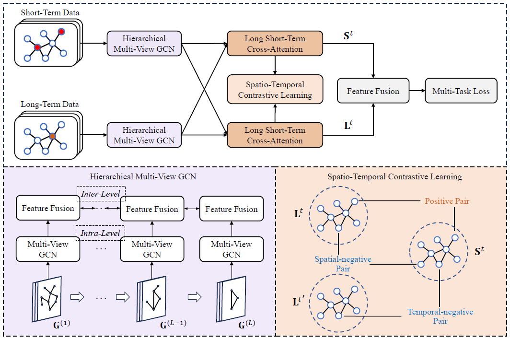

## ST-TAR
This is the implementation of the paper "ST-TAR: An Efficient Spatio-Temporal Learning Framework for Traffic Accident Risk Forecasting".
<p align="center">
  
  <br />
</p> 

## Usage

train model on NYC:
```
python train.py --config config/nyc/NYC_Config.json --gpus 0
```

train model on Chicago:
```
python train.py --config config/chicago/Chicago_Config.json --gpus 0
```

